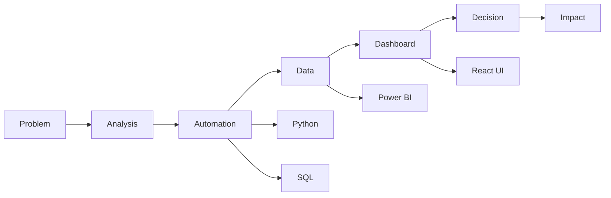
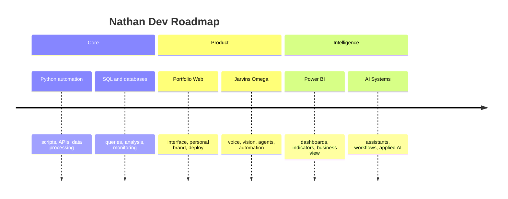

<div align="center">


<br>

<h1>Nathan Pires Dantas</h1>

<code>Cybersecurity</code>
<code>Automation</code>
<code>Data</code>
<code>AI</code>
<code>Python</code>
<code>SQL</code>
<code>Power BI</code>
<code>React</code>

<br><br>


<br>


</div>

---

## `>_ system_profile`

```txt
nathan@np-dev:~$ whoami

name        : Nathan Pires Dantas
location    : São Carlos, SP - Brasil
role        : Computer Science Student
focus       : Automation, Data, Web Development, Cybersecurity and AI
mission     : Hack the problem. Build the solution.
mindset     : Think like a hacker. Build like an engineer.
```

<table>
<tr>
<td width="60%" valign="top">

### `>_ about_me`

Sou estudante de **Ciência da Computação** e construo soluções com foco em **automação, dados, desenvolvimento web e segurança da informação**.

Minha mentalidade é simples: **entender o problema, automatizar o processo e entregar algo útil de verdade**.

| Area | Status |
|---|---|
| Automation | `online` |
| Data & Dashboards | `online` |
| Python & SQL | `online` |
| Web Development | `building` |
| Cybersecurity | `studying` |
| Artificial Intelligence | `evolving` |

</td>
<td width="40%" valign="top">

### `>_ quick_scan`

```txt
[OK] Problem analysis
[OK] Process automation
[OK] Data intelligence
[OK] Product mindset
[OK] Security mindset
[OK] Continuous learning
```

</td>
</tr>
</table>

---

## `>_ interactive_terminal`

<details open>
<summary><strong>Open identity terminal</strong></summary>

```bash
nathan@np-dev:~$ ./profile --summary

[IDENTITY]
Computer Science student focused on practical technology.

[MAIN_STACK]
Python | SQL | Power BI | React | FastAPI | Linux

[MISSION]
Build real solutions, automate processes and turn data into decisions.

[CURRENT_MODE]
learning=true
building=true
shipping=true
```

</details>

<details>
<summary><strong>Open cybersecurity mode</strong></summary>

```bash
nathan@np-dev:~$ ./security --mindset

[SECURITY]
- Secure thinking
- Access validation
- Process monitoring
- Risk analysis
- Evidence organization
- Incident mindset
```

</details>

<details>
<summary><strong>Open automation mode</strong></summary>

```bash
nathan@np-dev:~$ ./automation --pipeline

input       -> repetitive task
analysis    -> process mapping
script      -> Python / SQL / Power Automate
validation  -> logs, evidence and control
output      -> productivity and reliability
```

</details>

---

## `>_ core_stack`

<table>
<tr>
<td align="center" width="25%">

### Python

`automation`  
`scripts`  
`data processing`  
`APIs`

</td>
<td align="center" width="25%">

### SQL

`queries`  
`databases`  
`analysis`  
`monitoring`

</td>
<td align="center" width="25%">

### Power BI

`dashboards`  
`indicators`  
`insights`  
`decision-making`

</td>
<td align="center" width="25%">

### React

`interfaces`  
`components`  
`portfolio`  
`web systems`

</td>
</tr>
</table>

<div align="center">


</div>

---

## `>_ architecture_as_code`



---

## `>_ featured_projects`

<table>
<tr>
<td width="50%" valign="top">

### `jarvins-omega`

Sistema pessoal de IA multimodal com voz, visão, automações, memória e integração com dispositivos.

```txt
stack: AI | Python | React | FastAPI | Automation
status: building
```

</td>
<td width="50%" valign="top">

### `data-dashboards`

Projetos de análise de dados, indicadores, relatórios e visualizações para tomada de decisão.

```txt
stack: SQL | Power BI | Excel | Python | Analytics
status: evolving
```

</td>
</tr>
<tr>
<td width="50%" valign="top">

### `automacao-python`

Automações para eliminar tarefas repetitivas, organizar informações e aumentar produtividade.

```txt
stack: Python | Scripts | APIs | Process Automation
status: online
```

</td>
<td width="50%" valign="top">

### `portfolio-web`

Portfólio profissional com foco em apresentação, projetos, carreira e identidade visual.

```txt
stack: React | Tailwind | Vercel | UI/UX
status: online
```

</td>
</tr>
</table>

---

## `>_ live_metrics`

<div align="center">


<br><br>


</div>

<details>
<summary><strong>Open detailed language cards</strong></summary>

<br>

<div align="center">


</div>

</details>

---

## `>_ activity_graph`

<div align="center">


</div>

---

## `>_ contribution_snake`

<div align="center">

<picture>
  <source media="(prefers-color-scheme: dark)" srcset="https://raw.githubusercontent.com/thannth75/thannth75/output/github-contribution-grid-snake-dark.svg">
  <source media="(prefers-color-scheme: light)" srcset="https://raw.githubusercontent.com/thannth75/thannth75/output/github-contribution-grid-snake.svg">
  
</picture>

</div>

---

## `>_ system_core`

<table>
<tr>
<td width="33%" valign="top">

### `status`

```txt
focus        ██████████ 100%
motivation   ██████████ 100%
learning     █████████░  90%
execution    █████████░  90%
bugs_today   0
uptime       24/7
```

</td>
<td width="34%" align="center" valign="middle">

<br>

<h2><code>NP</code></h2>

<code>BUILD</code>
<code>AUTOMATE</code>
<code>DEFEND</code>

<br><br>

<strong>Think like a hacker.</strong>  
<strong>Build like an engineer.</strong>

</td>
<td width="33%" valign="top">

### `currently`

```txt
[+] Building secure systems
[+] Automating boring tasks
[+] Exploring AI and data
[+] Creating real products
[+] Studying full stack development
```

</td>
</tr>
</table>

---

## `>_ current_roadmap`



---

<div align="center">


</div>
