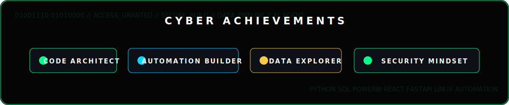
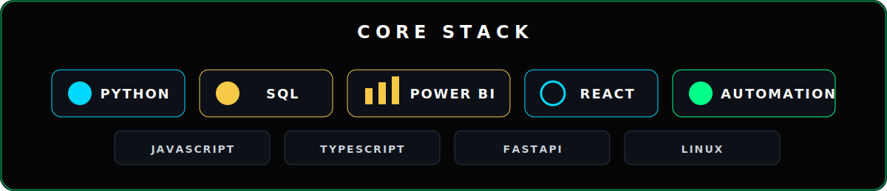
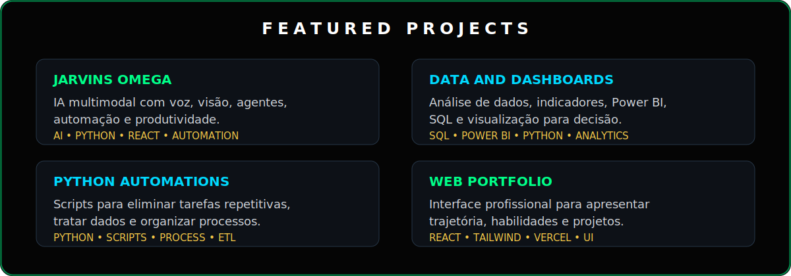
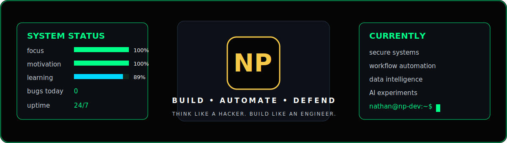

  

  

  

 

  

 

<table>
<tr>
<td width="58%" valign="top">

### `nathan@np-dev:~$ whoami`

Sou estudante de **Ciência da Computação** e construo soluções com foco em **automação, dados, desenvolvimento web, segurança da informação e inteligência artificial**.

Meu objetivo é transformar problemas reais em sistemas úteis, organizados e escaláveis, usando tecnologia de forma prática e profissional.

 

  

- Automação de processos para reduzir trabalho repetitivo.
- Dashboards, indicadores e análises para tomada de decisão.
- Desenvolvimento full stack com foco em soluções reais.
- Estudos em segurança da informação e IA aplicada.

</td>
<td width="42%" valign="top" align="center">

</td>
</tr>
</table>

 

  
    
  

 

  
    
  

 

  

 

  

  

 

  
    
  

 

  

 

 

  

 

<picture>
  <source media="(prefers-color-scheme: dark)" srcset="https://raw.githubusercontent.com/thannth75/thannth75/output/github-contribution-grid-snake-dark.svg">
  <source media="(prefers-color-scheme: light)" srcset="https://raw.githubusercontent.com/thannth75/thannth75/output/github-contribution-grid-snake.svg">
  
</picture>

 

  

 

  
    
  

 

