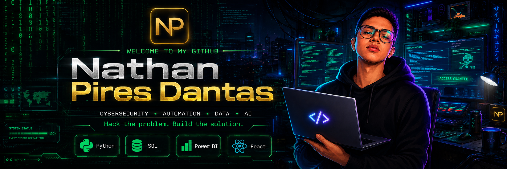
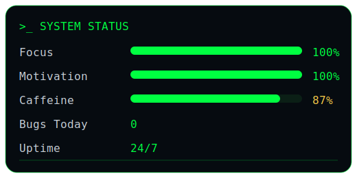

 

 

---

## `>_ ABOUT ME`

<table>
<tr>
<td width="58%" valign="top">

Sou estudante de **Ciência da Computação** e construo soluções com foco em **automação, dados, desenvolvimento web e segurança da informação**.

Minha mentalidade é simples: **entender o problema, automatizar o processo e entregar algo útil de verdade**.

 

<table>
<tr>
<td width="170px">

</td>
<td>Foco em tecnologia, segurança, dados e automações inteligentes.</td>
</tr>
<tr>
<td>

</td>
<td>Experiência com <strong>Python, SQL, Power BI, automações e dashboards</strong>.</td>
</tr>
<tr>
<td>

</td>
<td>Evoluindo em <strong>IA, desenvolvimento full stack, APIs e sistemas multiplataforma</strong>.</td>
</tr>
<tr>
<td>

</td>
<td>Construindo projetos reais com visão de produto, usabilidade e impacto.</td>
</tr>
</table>

</td>
<td width="42%" valign="top">

</td>
</tr>
</table>

## `>_ LANGUAGES & TOOLS`

  

---

## `>_ GITHUB STATS`

  

  

<strong>Open alternative live cards</strong>

 

---

## `>_ FEATURED PROJECTS`

<table>
<tr>
<td width="50%" valign="top">

  

Sistema pessoal de IA multimodal com voz, visão, automações, memória e integração com dispositivos.

`AI` `Automation` `Python` `React` `FastAPI`

</td>
<td width="50%" valign="top">

  

Projetos de análise de dados, indicadores, relatórios e visualizações para tomada de decisão.

`SQL` `Power BI` `Excel` `Python` `Analytics`

</td>
</tr>
<tr>
<td width="50%" valign="top">

  

Automações para eliminar tarefas repetitivas, organizar informações e aumentar produtividade.

`Python` `Scripts` `APIs` `Process Automation`

</td>
<td width="50%" valign="top">

  

Portfólio profissional com foco em apresentação, projetos, carreira e identidade visual.

`React` `Tailwind` `Vercel` `UI/UX`

</td>
</tr>
</table>

---

## `>_ ACTIVITY GRAPH`

---

## `>_ CONTRIBUTION SNAKE`

<picture>
  <source media="(prefers-color-scheme: dark)" srcset="https://raw.githubusercontent.com/thannth75/thannth75/output/github-contribution-grid-snake-dark.svg" />
  <source media="(prefers-color-scheme: light)" srcset="https://raw.githubusercontent.com/thannth75/thannth75/output/github-contribution-grid-snake.svg" />
  
</picture>

---

## `>_ SYSTEM STATUS`

<table>
<tr>
<td width="39%" valign="top">

</td>
<td width="22%" align="center" valign="middle">

  

<strong>BUILD • AUTOMATE • DEFEND</strong>

  

<code>secure</code>
<code>data</code>
<code>automation</code>

</td>
<td width="39%" valign="top">

</td>
</tr>
</table>

<strong>Think like a hacker. Build like an engineer.</strong>

---

