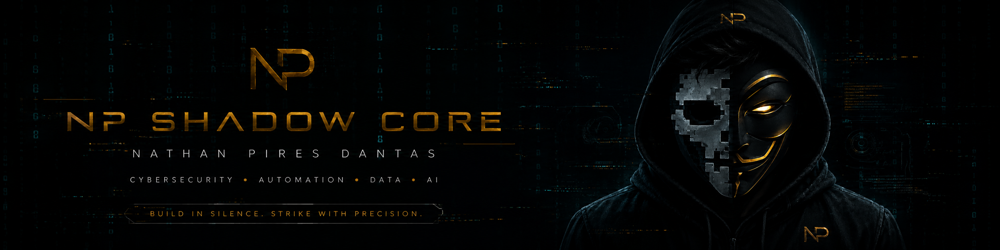
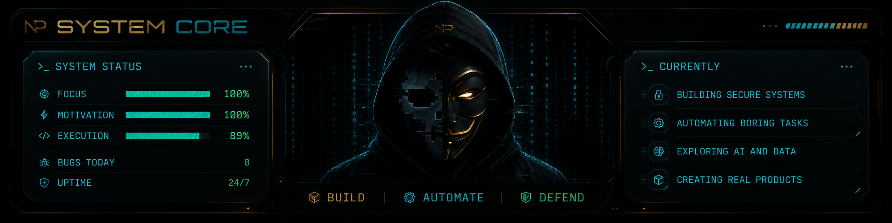

<div align="center">



<br/>


<br/>


</div>

---

## `>_ SHADOW CORE / ABOUT ME`

<table>
<tr>
<td width="62%" valign="top">

Sou **Nathan Pires Dantas**, estudante de **Ciência da Computação**, apaixonado por construir soluções com foco em:

- **Cybersecurity**
- **Automation**
- **Data & Analytics**
- **Web Development**
- **AI & Productivity Systems**

Minha abordagem é simples:

- entender o problema de verdade
- automatizar o que é repetitivo
- transformar dados em decisão
- construir soluções úteis, seguras e com impacto real

<br/>


<br/><br/>


</td>
<td width="38%" valign="top">

```bash
nathan@shadow-core:~$ whoami

> Developer
> Automation Builder
> Data Explorer
> Problem Solver
> Security Mindset
> Real Product Builder

nathan@shadow-core:~$ status

> building secure systems
> automating workflows
> exploring AI and data
> shipping useful solutions
```

</td>
</tr>
</table>

---

## `>_ CORE STACK`

<div align="center">


<br/><br/>


</div>

---

## `>_ GITHUB STATS`

<div align="center">


<br/><br/>


<br/><br/>


</div>

---

## `>_ FEATURED PROJECTS`

<table>
<tr>
<td width="50%" valign="top">


<br/><br/>

Sistema pessoal de IA multimodal com voz, visão, automações, memória, agentes e integração com dispositivos.

`AI` `Automation` `Python` `React` `FastAPI`

</td>
<td width="50%" valign="top">


<br/><br/>

Projetos de análise de dados, indicadores, relatórios e visualizações para tomada de decisão com SQL, Power BI e Excel.

`SQL` `Power BI` `Excel` `Python` `Analytics`

</td>
</tr>
<tr>
<td width="50%" valign="top">


<br/><br/>

Automações para eliminar tarefas repetitivas, organizar informações e aumentar produtividade em fluxos reais.

`Python` `Scripts` `APIs` `Process Automation`

</td>
<td width="50%" valign="top">


<br/><br/>

Portfólio profissional com foco em apresentação, projetos, identidade visual e presença digital.

`React` `Tailwind` `Vercel` `UI/UX`

</td>
</tr>
</table>

---

## `>_ ACTIVITY GRAPH`

<div align="center">


</div>

---

## `>_ CONTRIBUTION SNAKE`

<div align="center">

<picture>
  <source media="(prefers-color-scheme: dark)" srcset="https://raw.githubusercontent.com/thannth75/thannth75/output/github-contribution-grid-snake-dark.svg" />
  <source media="(prefers-color-scheme: light)" srcset="https://raw.githubusercontent.com/thannth75/thannth75/output/github-contribution-grid-snake.svg" />
  
</picture>

</div>

---

## `>_ SYSTEM CORE`

<div align="center">



<br/>

<strong>Think like a hacker. Build like an engineer.</strong>

</div>

---

## `>_ CONNECT`

<div align="center">

<a href="https://www.linkedin.com/in/nathanpiresdantas" target="_blank">
  
</a>
<a href="mailto:nathanpiresdantas@gmail.com">
  
</a>
<a href="https://nathan-portifolio.vercel.app/" target="_blank">
  
</a>

</div>

---

<div align="center">


</div>
