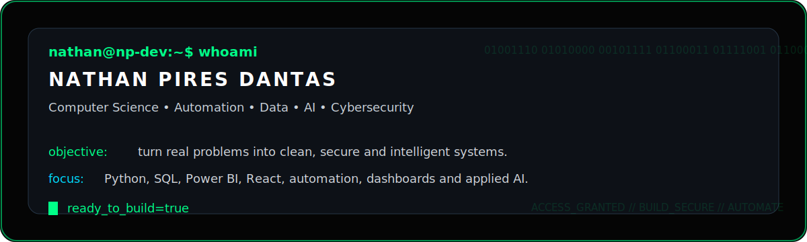
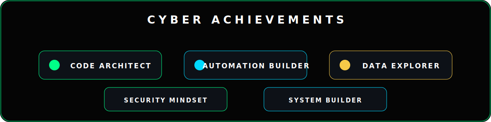
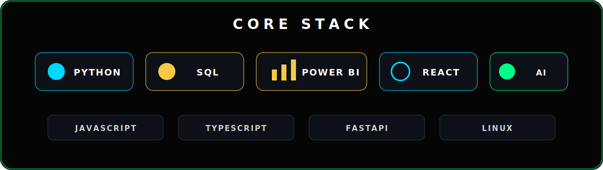
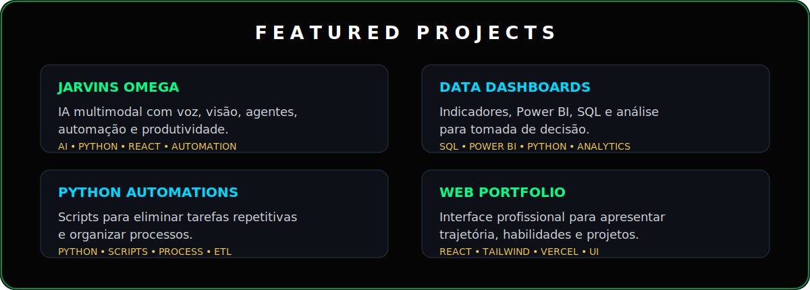
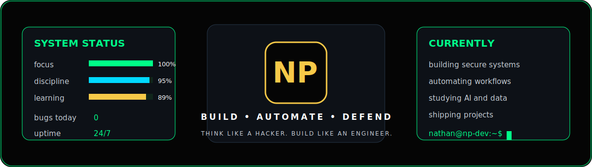

  

  

  

## `>_ SYSTEM_PROFILE`

  

## `>_ CYBER_ACHIEVEMENTS`

  

## `>_ CORE_STACK`

  

## `>_ GITHUB_STATS`

  

  

## `>_ FEATURED_PROJECTS`

  

## `>_ CONTRIBUTION_SNAKE`

<picture>
  <source media="(prefers-color-scheme: dark)" srcset="https://raw.githubusercontent.com/thannth75/thannth75/output/github-contribution-grid-snake-dark.svg">
  <source media="(prefers-color-scheme: light)" srcset="https://raw.githubusercontent.com/thannth75/thannth75/output/github-contribution-grid-snake.svg">
  
</picture>

 

  

## `>_ SYSTEM_CORE`

  

 

  

